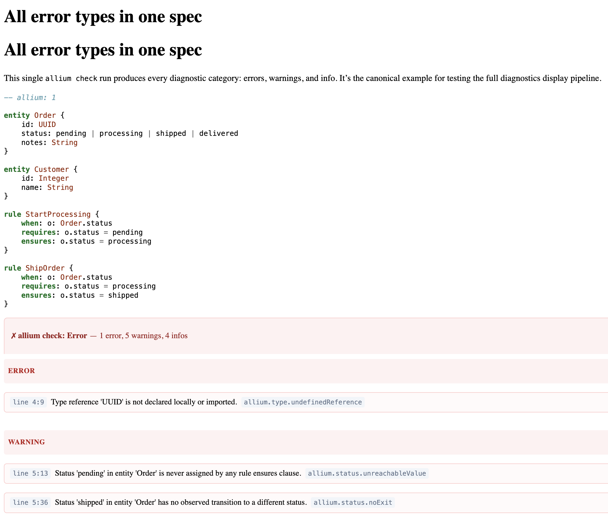

# all-errors

A self-contained example that triggers every `allium check` diagnostic
category (error, warning, info) in a single spec.



## Prerequisites

- [pandoc](https://pandoc.org) — `brew install pandoc`
- [pandoc-allium](https://github.com/iwillig/pandoc-allium) — `pip install pandoc-allium`
- [allium](https://juxt.github.io/allium/) — `brew install juxt/allium/allium`

## Build

```sh
just build
```

Or manually:

```sh
pipenv run pandoc -F pandoc-allium \
  --syntax-definition "$(pipenv run pandoc-allium --syntax-path)" \
  --css "$(pipenv run pandoc-allium --css-path)" \
  -s index.md -o output.html
```

Open `output.html` in a browser to see the severity-grouped diagnostics
with color-coded cards (red errors, amber warnings, blue info).
